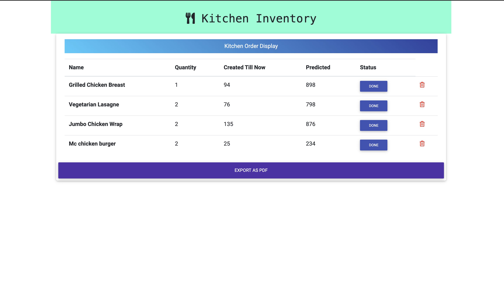

# ![Kitchen Inventory]
> ### Kitchen Inventory (CRUD,advanced patterns) 

### [Demo](https://compassionate-galileo-47ae33.netlify.com)&nbsp;&nbsp;&nbsp;&nbsp;

This codebase was created to demonstrate a fully fledged application built with Angular that interacts with an actual backend server including CRUD operations, authentication, routing, pagination, and more. We've gone to great lengths to adhere to the [Angular Styleguide](https://angular.io/styleguide) & best practices.

### Making requests to the backend API

For convenience, we have a live API server running at https://react-mentor-admin.herokuapp.com/api-docs/ for the application to make requests against. You can view [the API spec here](https://github.com/ikhlaq1/CRUD-API-in-nodejs-with-mongoDB-Swagger-Docs-) which contains all routes & responses for the server.

The source code for the backend server (available for Node, Rails and Django) can be found in the [Node-Express-API](https://github.com/ikhlaq1/CRUD-API-in-nodejs-with-mongoDB-Swagger-Docs-).

If you want to change the API URL to a local server, simply edit `src/environments/environment.ts` and change `api_url` to the local server's URL (i.e. `localhost:8080/api`)

# Getting started

Make sure you have the [Angular CLI](https://github.com/angular/angular-cli#installation) installed globally. We use [NPM] to manage the dependencies, so we strongly recommend you to use it. you can install it from [Here](https://nodejs.org/en/), then run `npm install` to resolve all dependencies (might take a minute).

Run `ng serve` for a dev server. Navigate to `http://localhost:4200/`. The app will automatically reload if you change any of the source files.

### Building the project
Run `ng build` to build the project. The build artifacts will be stored in the `dist/` directory. Use the `-prod` flag for a production build.

